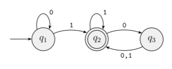
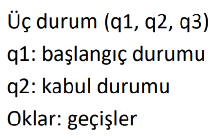
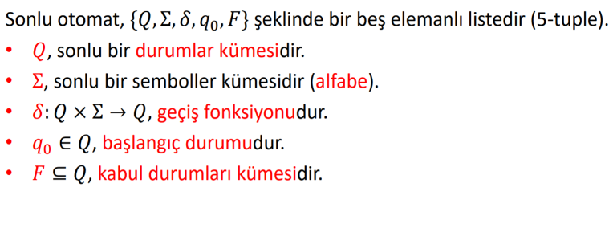
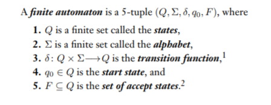
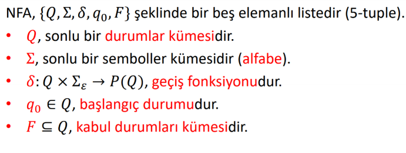
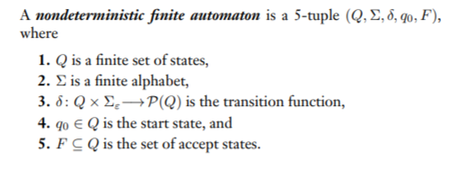

**BİÇİMSEL DİLLER VE OTOMATLAR**

# **Sözü Geçen Çalışmalar**

Sipser, M. (2013). *Introduction to the Theory of Computation.* Boston:
CENGAGE Learning.

**Giriş**\
(Bu maddeler kısa Google aramaları ile fikir sahibi olunması gereken,
teorik bilgilerdir.)\
Kitap Desteği olarak konu başlıklarına göre;

**Ders dokümanı, lisansta anlatılan içerikler doğrultusunda destek,
farklı kaynaklara yönlendirme ve yol gösterme amacıyla oluşturulmuştur.
Ders Slaytlarına erişiminiz olması ve bu kaynağı kullanmanız içeriklerin
anlaşılması açısından en verimli yol olacaktır.**

Kaynağına ulaşılıp ayrıntılı ders içerikleri incelenebilir.
Dokümantasyondaki (p.x) gibi sayfalar bu kitaptaki sayfaları
göstermektedir.

-   Bilgisayarların Sınırları Nelerdir? (Decidable-Undecidable Problems)

-   Time -- Memory Complexity

-   Matematiksel Terimler hatırlanmalı, çünkü ders içinde matematiksel
    ifadeler de tanımlanacak

    -    

    -    

-   Çizgeler (Graflar)

-   Stringler ve Diller

    -   String, sembollerden oluşan yapı

    -   Dil, string kümesi;\
        olarak tanımlanabilir.

-   {x,y,z} alfabesi için örnek dil: D = {x, xz, xyy, yzxy, xxy, xzzy}
    gibi

-   A = {w \| w sadece 1 tane x içerir} gibi

> Tanımlamalar ile dil ifade edilebilir. Ve bu dillere uygun otomatlar
> oluşturulduğu zaman, "Bu otomat bu dili tanır" gibi ifadeler
> kullanılabilir. Soru olarak bir dil verilir ve "Bu dili tanıyan
> otomat" istenilebilir.

**Sonlu Otomat**
 

**Örnek:** (p.34) 
 
Otomat: 
 
Otomattaki göstergelerin anlamları: 
 

GENEL TANIM:

 
 

Yardımcı olacak çözümlü örnek soru sayfaları;

-   P.38- 1.11

-   P.43- 1.21

 

**SONLU OTOMAT TASARIM ADIMLARI:**

1.  Kendini otomatın yerine koy!

2.  Kaç durum var?

3.  İhtiyacın olan şartları sorgula.

4.  Hangi durumdan başladığını bul.

5.  Kabul durumlarını belirle.

6.  Geçiş koşullarına göre geçişleri belirle.

**Deterministik Sonlu Otomat (DFA) -- Determinisitik Olmayan Sonlu
Otomat (NFA)**

1.  <https://www.geeksforgeeks.org/introduction-of-finite-automata/>

2.  <https://www.geeksforgeeks.org/designing-deterministic-finite-automata-set-1/>

3.  <https://www.geeksforgeeks.org/designing-non-deterministic-finite-automata-set-1/>

2\. ve 3. Linklerde, en sondaki "set-x" (x bir sayı) şeklinde arttırarak
farklı incelemelerle örnekler ile farklarını daha net anlayabiliriz.

**NFA Örnek Sayfası**

-   P.51- 1.30

-    
-    P.54- 1.38

**DFA vs. NFA Örneği**

-   P.56- 1.41

**NFA DFA Denkliği**

-   Her NFA için ona denk bir DFA vardır.

-   P.54- 1.39

<https://www.geeksforgeeks.org/conversion-from-nfa-to-dfa/>

**Regular Expressions**

<https://www.tutorialspoint.com/automata_theory/regular_expressions.htm>

<https://www.javatpoint.com/automata-regular-expression>

**FA to RE**

<https://www.geeksforgeeks.org/generating-regular-expression-from-finite-automata/>

<http://www.jflap.org/tutorial/fa/fa2re/index.html>

**RE to FA**

<https://www.geeksforgeeks.org/designing-finite-automata-from-regular-expression-set-1/>

En sondaki "set-x" (x bir sayı) şeklinde arttırarak farklı incelemelerle
örnekler ile farklarını daha net anlayabiliriz.

<https://www.javatpoint.com/automata-conversion-of-re-to-fa>

**Düzensiz Diller**

<https://acikders.ankara.edu.tr/pluginfile.php/87075/mod_resource/content/0/6-notes-NonregularLanguages.pdf>

**Pumping Lemma**

P.77

P.80- 1.73

<https://www.geeksforgeeks.org/pumping-lemma-in-theory-of-computation/>

**Düzensiz ve Pumping Lemma için**

<https://ocw.mit.edu/courses/electrical-engineering-and-computer-science/6-045j-automata-computability-and-complexity-spring-2011/lecture-notes/MIT6_045JS11_lec05.pdf>

**Tüm durumlar için bir örnek ve kıyaslama tablosu olarak linki
inceleyebilirsiniz.**

<http://www.cs.cornell.edu/courses/cs2800/2009sp/280wk14_x4.pdf>

**Başlıklara uygun önerilebilecek video kaynağı:**

<https://youtu.be/58N2N7zJGrQ>

**Türkçe Çözümlü Çıkmış Sorular**

<https://web.itu.edu.tr/~aydeger/BLG311.php?lang=tr>

<https://kilinjos.files.wordpress.com/2010/07/sorular1.pdf>

<https://ceng2.ktu.edu.tr/~cakir/otomata.html>

**İngilizce Çözümlü Çıkmış Sorular**

<https://cs.fit.edu/~wds/classes/formal/Tests/pmidterm-key.pdf>

<http://suraj.lums.edu.pk/~cs311w02/midtermSol.pdf>

<https://www.cs.utexas.edu/users/ear/cs341/Exams.html>

<https://ceng491.cankaya.edu.tr/uploads/files/491MT1Fall1920.pdf>
