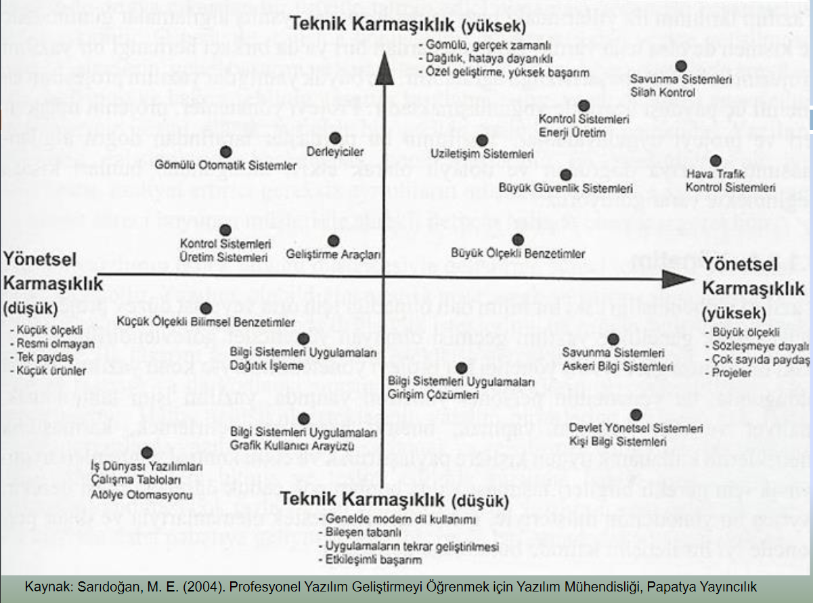
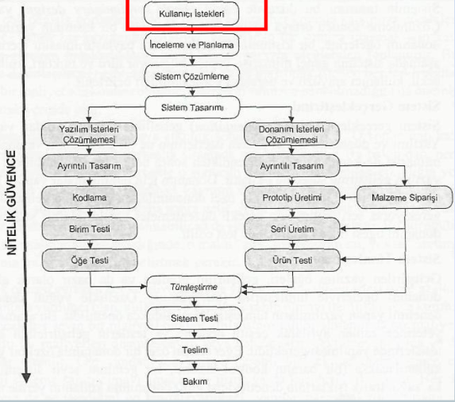
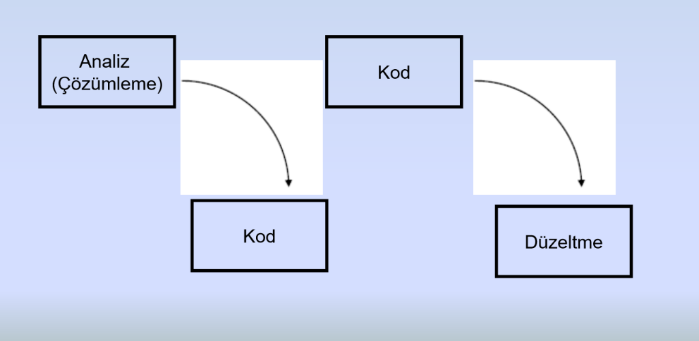
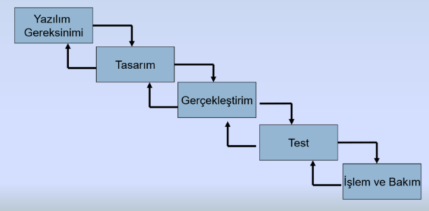
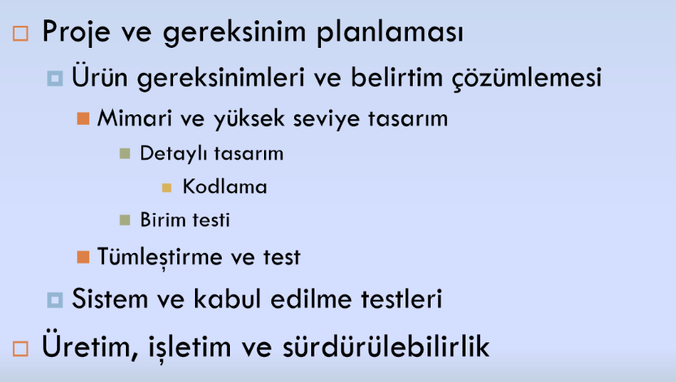
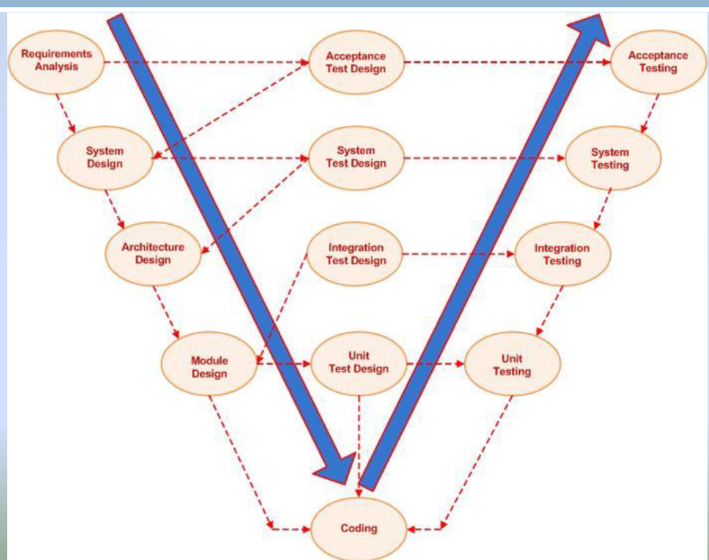
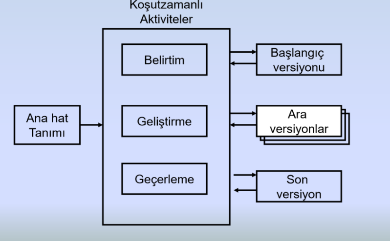
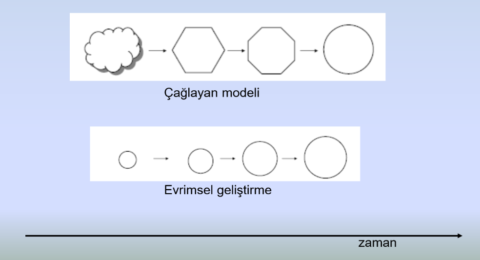
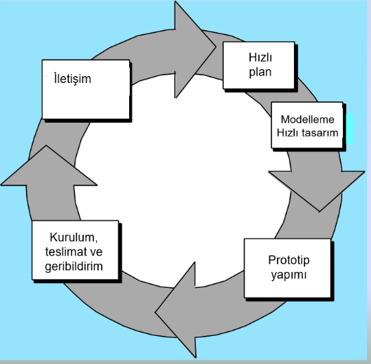
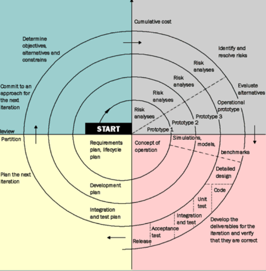

**1.Hafta**

**Yazılım Projesi Yürütmemiz İstenecek.**

Pandemi dolayısıyla Fiziksel olarak kod beklenmiyor yani analiz, tasarım
gibi aşamaları ilerlenmiş dokümantasyonlar bekleniyor. Mutlaka bir
mühendislik uygulaması olacak. Mühendislik bakış açısıyla bir problem
belirlenecek.

1.  Sosyal Medya Yazılımı

2.  Görüntü İşleme Yazılımı

3.  Yapay Zeka Yazılımı

Başlıklarından birini seçip seçilen başlığa göre bir proje belirlenecek.

Proje grupları 1-2-3 kişi olabilir.

Projede kodlama yok ve gerçekleştirme beklenmiyor.

Fırsat olursa dönem sonunda projelerin sunumu bekleniyor.

Bu projeleri dair 3 tane rapor yüklenecek. Test dokümanını istenmiyor
çünkü kod yazmıyoruz.

**SPMP** 1 Nisan'da istenecek. Bir proje yönetim planı, Her ekip üyesi
ne yapacak, aşamalar, kullanılacak süreç modelleri, plan, ekip
içerisindeki roller gibi bilgilerin bulunduğu kısaca yönetsel kararlar
olan bir rapor hazırlanacak.

**SRS** 29 Nisan'da istenecek. (Gereksinim Dokümanı) analiz çıktımız.
Yazılımımızın ne yapıyor olacağını açıklayacağımız bir rapor. Örnek
şablon yollanacak.

**SDD** en çok içerik beklenen tasarım dokümantasyonu. İşin yaratıcılık
kısmı, hikayesi, yazılımımızın detayları, diyagramlarımız,
senaryolarımız, arayüz tasarımlarımız, arkayüz mimari tasarımları bu
raporda bulunacak.

**Dersin Amacı**

Yazılım mühendisliğinin temel prensiplerini açıklamak

-   Yazılım süreçleri,

-   Yazılım proje yönetimi,

-   Yazılım isterleri,

-   Yazılım tasarımı,

-   Geliştirme, test ve bakım aktivitelerini içerir

Yazılımın ilk yıllarında programlar; oldukça küçük, tek kişinin yazdığı
ve sadece sadece alanında uzman kişilerin kendileri için geliştirdiği ve
kullandığı şeyler olmasına karşın günümüzde programlama oldukça büyük ve
karmaşık, uzun süre zarfında birbirleriyle iş birliği içinde çalışan
takımlar tarafından geliştiriliyor.

**Bilgisayar programı,** yazdığımız komutlar grubudur.

Bilgisayar programını **yazılım** yapan şey, bilgisayar programına ek
olarak yapılandırma dosyalarını eklemek, kullanıcı dokümantasyonunu
yapmak, destek hizmetlerini vermek, eğitimlerini vermek anlamına
geliyor.

Yazılımların ürün olarak ve ürün sunmak için bir araç olan yazılım
olarak ikili rolü vardır.

Ayrıca yazılımların Uygulama alanları;

-   Sistem yazılımları

-   Uygulama yazılımları

-   Mühendislik ya da bilimsel yazılımlar

-   Gömülü yazılımlar

-   Ürün hattı yazılımları (eğlence yazılımları da dahil)

-   Web-uygulamaları

-   Yapay zekâ yazılımları

**Mühendislik**; doğadaki maddenin ve enerji kaynaklarının, insanların
kullanımı için ve bunların yararlı hale getirilmesi için bilimsel ve
matematiksel prensiplerin uygulanmasıdır.

Mühendisler, uygun olan yerlerde teori + metot + araçları uygulayarak
işlerin yürütülmesini sağlarlar.

"**Yazılım mühendisliği**, gerçek makinelerde doğru ve verimli çalışan
ekonomik yazılımlar elde etmek için sağlam mühendislik prensiplerinin
elde edilmesidir." \[Naur and Randell, 1969\]

Yazılım mühendisliği; amacı zamanında teslim edilen, belirlenen bütçe
dahilinde geliştirilen ve müşterilerin ihtiyaçlarını karşılayan hatasız
yazılımlar geliştirmek olan bir bilim dalıdır.

Burada anahtar öğeler;

-   YÖNTEMLER(Methods): Teknik NASIL-ları sağlar.

> Yöntemler çeşitli görevleri(Tasks) içerir; Proje planlama, kestirim
> (estimation), ister çözümleme, tasarım, programlama (coding), sınama
> (testing) gibi.

-   ARAÇLAR(Tools): Yöntemleri (yarı) otomatikleşmiş olarak destekler.

-   YORDAMLAR(Procedures): Yöntem ve araçları birbirine bağlar.
    Yöntemlerin, teslim edilebilir ürünlerin (deliverables),
    kontrollerin ve kilometre taşlarının (milestones) sırasını tanımlar.

**2. Hafta**

+----------------------------------+----------------------------------+
| İNŞAAT MÜHENDİSLİĞİ              | YAZILIM MÜHENDİSLİĞİ             |
+==================================+==================================+
| KÖPRÜLER                         | YAZILIM                          |
+----------------------------------+----------------------------------+
| -   Devamlı                      | -   Devamsız                     |
|                                  |                                  |
|     -   Matematik                |     -   Mantık, Soyut matematik  |
|                                  |                                  |
|     -   Sınanması ve             |     -   Sınanması ve             |
|         Çözümlenmesi kolay       |         çözümlenmesi zor         |
+----------------------------------+----------------------------------+
| -   Fiziksel Maddelerden         | -   Sanal maddelerden yapılırlar |
|     yapılırlar.                  |                                  |
|                                  |     -   Tüm maliyetler aşikâr    |
|     -   Bazı maliyetler          |         değildir.                |
|         aşikardır.               |                                  |
|                                  |     -   Değişiklik yapmak kolay  |
|     -   Yapım aşamasından sonra  |         olabilir (aslında        |
|         değişiklik yapmak        |         değildir.)               |
|         zordur.                  |                                  |
+----------------------------------+----------------------------------+
| -   Eğer çökerse yapımı          | -   Eğer çökerlerse yazılım      |
|     gerçekleştirenlerin mahkeme  |     sağlayıcıları kullanıcıları  |
|     edilecekleri aşikardır.      |     suçlar ve yükseltmeler için  |
|                                  |     masraf keserler.             |
| -   Geliştiricilerin ehliyete    |                                  |
|     ihtiyaçları vardır.          | -   Herkes yazılım üretebilir.   |
+----------------------------------+----------------------------------+
| -   İsterler (Genellikle) aşikar | -   İsterler anlaşılmaz ve       |
|     ve tanımlamaları kolaydır.   |     tanımlanması zordur.         |
|                                  |                                  |
| -   İyi bir tasarım herkes için  | -   İyi bir tasarım ancak        |
|     hemen aşikardır.             |     uzmanlar için açıktır,       |
|                                  |     etkileri de daha sonradır.   |
+----------------------------------+----------------------------------+

  BİLGİSAYAR BİLİMLERİ(MÜHENDİSLİĞİ)                                                                            YAZILIM MÜHENDİSLİĞİ
  ------------------------------------------------------------------------------------------------------------- --------------------------------------------------------------------------------------------------------------------
  Bilgisayar billimleri, bilgisayar ve yazılım sistemlerinin temelinde kuram(teori) ve yöntemlerle ilgilenir.   Yazılım Mühendisliği yararlı yazılımları geliştirilmesi ve teslim edilebilmesi için faydalı pratiklerle ilgilenir.

  SİSTEM MÜHENDİSLİĞİ                                                                                                             YAZILIM MÜHENDİSLİĞİ
  ------------------------------------------------------------------------------------------------------------------------------- -----------------------------------------------------------------------------------------------------------------------------------------------------
  Sistem mühendisliği bilgisayar tabanlı sistemlerin geliştirilmesinde donanım + yazılım + süreç gibi tüm yönleriyle ilgilenir.   Yazılım Mühendisliği bu sürecin sistem dahilindeki yazılım altyapısı, kontrolü, uygulaması ve veritabanı geliştirmesi ile ilgilenen bir parçasıdır.

Yazılım Özellikleri,

-   Yazılım geliştirilir. Klasik anlamda imal edilmez.

-   Yazılım aşınmaz/ yıpranmaz fakat yapılan değişiklikler nedeniyle
    geriler.

    -   Pek çok değişiklikten sonra yeniden tasarlanması gerekebilir.

Yazılım kullanıcısına istenen işlevleri ve performansı sunmalı ve buna
ek olarak:

-   Sürdürülebilirlik: Yazılım değişen ihtiyaçlara göre
    gelişebilmelidir.

-   Güvenilebilirlik: Yazılım güvenilir olmalıdır.

-   Verimlilik: Yazılım sistem kaynaklarını boşa harcamamalıdır.

-   Kullanılabilirlik: Sistem tasarlandığı kullanıcıları için kolay
    kullanılabilir olmalıdır.

Genel yazılım süreci çerçevesi:

-   İletişim

    -   Müşteri işbirliği ve gereksinim toplama.

-   Planlama

    -   Mühendislik iş planını oluşturur, teknik riskleri tanımlar,
        gerekli kaynakları listeler, iş ürünleri üretilir ve iş zaman
        planı tanımlanır.

-   Modelleme

    -   Geliştirici müşterilerin yazılım gerekleri ve yazılım tasarımını
        anlamasına yardımcı olacak modellerin oluşturulması.

-   Yapım

    -   Kod oluşturma ve test.

-   Kurulum

    -   Müşteriye yazılımın değerlendirme ve geri bildirim için
        teslimatı.

**Yazılım süreci**, Yüksek kalitede yazılım ürünleri geliştirme için
takip ettiğimiz yol haritası.

Yazılım süreçleri,

-   Yazılım mühendisleri ve yöneticilerinin yazılım ürünü geliştirirken
    ihtiyaçlarını karşılamak için uyum sağlarlar.

-   Kolaylıkla kontrolden çıkabilecek aktivitelerin yönetilebilmesi ve
    gerçekleştirilebilmesi için çerçeve sağlar.

Yazılım geliştirme süreci için pek çok aktivite vardır. Tüm süreçleri
için ortak olanlar:

-   Yazılım Belirtimi (Software specification \\ Req. Engineering)

-   Yazılım Tasarım ve Gerçekleştirimi (Software design and
    implementation)

-   Yazılım Geçerleme(onaylama) (Software validation)

-   Yazılım Gelişimi (Software evolution)

**[3.hafta]{.ul}**

**Süreç modelleri**

Her probleme başlamadan önce [yapılabilirlik]{.ul} araştırması yapılır
ve her problemin çözümü bilgisayar otomasyonu olmayabilir.

Sistemin gerçekleştirimi genelde yazılım ve donanım olarak iki koldan
yapılır.

Teslim sürecinde

-   İşletmen eğitimi

-   Donanım bakım eğitimi

-   Yazılım bakım eğitimi

-   İlk kullanım sırasında ortaya çıkan hataların giderilmesi sağlanır.

**Genel Yazılım Süreç Modelleri**

[Kodla ve Düzelt:]{.ul}

-   Küçük projelerde sıklıkla kullanılan modeldir.

-   Tüm adımlardaki gayret direkt olarak ürüne katkı sağladığından çoğu
    müşteri ödeme yapmaktan mutlu olur.

-   Ürün yazılımı yapanlar tarafından kullanılacaksa avantajlı

-   Kodlamaya başlamadan önce değişiklikler tahmin edilmediğinden,
    ilerleyen süreçte kod karmaşıklaşır ve daha sonraki düzeltmeleri
    yapmak çok daha zor olur.

-   Müşterilerin sürece dahil edilmemesi kullanıcı ihtiyaçlarına uygun
    olmamasına yol açar.

-   Bireysel geliştiriciler için uygundur. Takımlar için değildir.

[Temel Çağlayan Modeli]{.ul}

-   Sonraki faz bir önceki faz
    tamamlanmadan başlayamaz.

-   Müşteriler tarafından, son kullanıcılar ve ekip tarafından iyi
    anlaşılan adımlardan oluşur.

-   Gereksinim adımı tamamlandıktan sonra sağlam bir temel oluşur.

-   Erken işin miktarını arttırır.

-   Proje yönetimi için işin dağılımı yapma açısından kolaydır.

-   Gereksinimleri iyi anlaşabilen projelerde iyi çalışır.

-   Test aşaması geliştirme sürecinin en sonunda yapılır. Hatalar
    yeniden tasarım gerekliliğini oluşturur ve önceki adımlara gidip
    tekrar test aşamasına dönmek maliyetli olabilir.

-   Kullanıcılar kaliteyi en son aşamadan önce anlayamazlar. (Sürece
    müşteriyi de dahil etmek bu problemi çözebilir)

-   Bitirme kriterleri olarak belgelendirmeye verilen önem bazı alanlar
    için süreci zorlaştırabilir.

-   Sistemin geliştirilmesi sürecinde gerekesinimlerin değişmesi projeyi
    zorlaştıracaktır. Çağlayan modeli gereksinimlerin baştan çok iyi
    anlaşabildiği projelerde kullanılmalıdır.

[V Modeli]{.ul}

-   Tamamen test odaklı ilerleyen bir yapısı var.

-   Verification ve validation planları erken aşamaşarda uygulanır.

-   Verification ve validation tüm teslim edilebilir üründe kullanılır.

-   Kullanımı kolaydır.

-    Aynı zamanda gerçekleştirilebilecek
    olaylara kolay imkan tanımaz.

-   Fazlar arasında tekrarlamaları kullanılmaz.

[Evrimsel Geliştirme]{.ul}

-   Anahat gereksinimleri ile başlangıç
    sistemi geliştirilir.

-   Müşteri geribildirimi ile pek çok versiyonla yavaş yavaş
    geliştirilir.

-   İki çeşit evrimsel geliştirme modeli vardır.

    -   Keşifçi Geliştirme (Ne istediğini pek açıklayamayan müşteriler
        için)

    -   Atılacak Prototipleme( Hiç açıklayamayan müşteriler için)

-   Kullanıcıkların gereksinimleri daha iyi anlamasını sağlar.

-   Sürecin görünürlüğü azdır.

-   Sistemler sıklıkla iyi yapılandırılamaz.(Sürekli değişiklikler
    yazılımın yapısına zarar verir.)

-   Bakımı zordur.

**Karşılaştırma**

[Prototipleme]{.ul}

-   Belgelendirmesi olmayan hızlı ve kirli prototipler ortaya çıkar.

-   Prototip hedefleri net değilse kod hackleme ya da jenga başlar.

-   Düzeltme aşaması atlanırsa, düşük performansa yol açar.

-   Müşteri prototipten de son ürün gibi görünüm ve etki bekler.

[Spiral Model]{.ul}

-   Hedefler, alternatifler ve kısıtlamalar belirlenir.

-   Alternatifler değerlendirilir, riskler hesaplanır

-   Aşamanın ürünü geliştirilir.

-   Sonraki faz planlanır.

-   Spiral üzerindeki her halka bir fazı gösterilir.

-   Her halkanın 4 aşaması var.

    -   1

    -   2

    -   3

    -   4

-   Kullanıcılar sistemi erken görebilirler.

-   Riske duyarlı yaklaşımı potansiyel zorlukları engeller.

-   Seçeneklere erken dikkate odaklanır.

-   Hataları erken gidermeye odaklanır.

-   Pahalı bir yöntemdir.

-   Spiral sonsuza kadar gidebilir.

-   Ara adımın fazlalığı nedeniyle çok fazla dokümantasyon gerektirir.

-   Büyük ölçekte projeler içindir.

-   Kontrat tabanlı yazılıma uymaz

    -   Yazılımın içten geliştirileceği varsayar.

    -   Kontrat tabanlı yazılımlar adım adım anlaşma esnekliğini
        sağlamaz.

[Format Sistem Geliştirme]{.ul}

[Yeniden Kullanıma Yönelik Geliştirme]{.ul}

